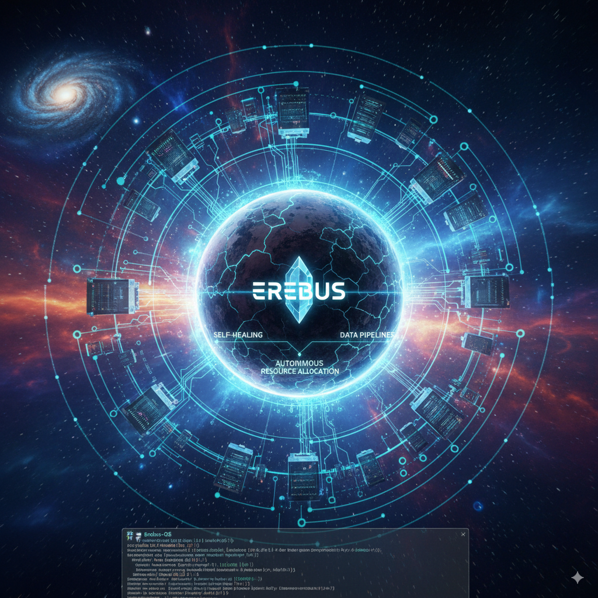

# 🌌 Erebus – Autonomous Infrastructure OS

Erebus is a next-generation **Autonomous Infrastructure Operating System** designed for cloudless, distributed computing.  
It brings together concepts from **Kubernetes, Terraform, Helm, and monitoring** into a unified, self-healing platform.  

Erebus is a next-generation Autonomous Infrastructure Operating System designed for cloudless, distributed computing environments. It unifies the power of modern infrastructure management by integrating concepts from Kubernetes, Terraform, Helm, and comprehensive monitoring into a single, self-healing, and intelligent platform.
Our vision for Erebus is to revolutionize how distributed systems are managed, moving towards a truly autonomous model where infrastructure provisions, scales, and repairs itself without human intervention, ensuring unparalleled resilience and efficiency.

✨ Features (Planned)
Self-Healing Capabilities: Automatic detection and resolution of infrastructure failures.
Autonomous Resource Allocation: Intelligent scaling and optimization of resources based on demand and predefined policies.
Unified Control Plane: A single interface to manage compute, storage, and networking across diverse environments.
Declarative Infrastructure as Code: Leverage familiar tools like Terraform and Helm for defining desired states.
Real-time Observability: Integrated monitoring (Prometheus, Grafana) for deep insights into system health and performance.
Multi-Cloud & Edge Support: Designed from the ground up to operate seamlessly across different cloud providers and edge locations.
AI-Driven Optimization: Future integration of AI for predictive scaling, anomaly detection, and advanced self-optimization.

---

## 📂 Project Structure
erebus/
├── backend/ # Go services (core logic, APIs, system modules)
│ ├── cmd/ # Entry points for services
│ ├── internal/ # Private app modules
│ └── pkg/ # Public reusable packages
├── deploy/ # Infrastructure (Terraform, Helm, K8s manifests)
├── docs/ # Documentation & design notes
├── frontend/ # Web UI (Next.js/React)
└── monitoring/ # Observability stack (Prometheus, Grafana, etc.)

## 🚀 Getting Started
### Backend
```bash
cd backend
go mod init github.com/Avik2024/erebus/backend
go run cmd/main.go

### Frontend
cd frontend
npm install
npm run dev

### Deploy
cd deploy
terraform init
terraform apply

🛠️ Tech Stack

Backend: Go (Golang)

Frontend: Next.js + TypeScript

Infrastructure: Terraform + Kubernetes + Helm

Monitoring: Prometheus + Grafana

CI/CD: GitHub Actions (planned)


📖 Documentation

All project documentation is inside the /docs
 directory.

### 2️⃣ Initialize Git and Commit
Run these commands:

```bash
cd ~/projects/erebus
git init
git add .
git commit -m "Initial commit: Erebus project structure with README"

3️⃣ Push to GitHub

Create a new empty repo on GitHub named erebus.
Then connect and push:

git remote add origin git@github.com:Avik2024/erebus.git
git branch -M main
git push -u origin main
```
📄 License
Erebus is open-source and licensed under the MIT License.


